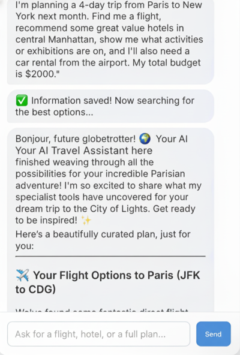

# langgraph-travel-agent

Production-ready LangGraph multi-agent system for travel planning. Async parallel tool orchestration across Amadeus, Hotelbeds, Twilio, and HubSpot.

[](LICENSE)
[](https://www.python.org/downloads/)



## What it does

- Natural-language travel request -> structured `TravelPlan`
- Parallel search across flights (Amadeus), hotels (Amadeus + Hotelbeds), activities (Amadeus)
- LLM-driven package generation (Budget / Balanced / Premium)
- Human-in-the-loop: customer-info form mid-conversation
- CRM (HubSpot) + SMS (Twilio) integration

## Architecture

```
┌──────────────────────────────────────────────────────┐
│  FastAPI server (backend/api/main.py)                │
│    POST /chat -> task_id (async, background)         │
│    GET  /chat/status/{task_id}                       │
│    POST /chat/customer-info                          │
└────────────────────────┬─────────────────────────────┘
                         ▼
┌──────────────────────────────────────────────────────┐
│  LangGraph                                           │
│    call_model_and_tools  --collecting_info--> END    │
│    call_model_and_tools  --synthesizing----> synth   │
│    synthesize_results    -----------------> END      │
└────────────────────────┬─────────────────────────────┘
                         ▼
┌──────────────────────────────────────────────────────┐
│  Tools (parallel asyncio.gather)                     │
│    search_flights             Amadeus                │
│    search_and_compare_hotels  Amadeus + Hotelbeds    │
│    search_activities_by_city  Amadeus                │
│    send_sms_notification      Twilio                 │
│    send_to_hubspot            HubSpot                │
└──────────────────────────────────────────────────────┘
```

## Layout

```
backend/
  api/main.py             FastAPI app
  config/settings.py      env loading, client init
  models/                 FlightOption, HotelOption, ActivityOption, TravelPackage, TravelPlan
  integrations/
    amadeus_client.py     hotel search, location conversion (airport / city / coords)
    hotelbeds_client.py   hotel search with X-Signature auth
  tools/
    flights.py            @tool search_flights
    hotels.py             @tool search_and_compare_hotels
    activities.py         @tool search_activities_by_city
    sms.py                @tool send_sms_notification
    crm.py                @tool send_to_hubspot
  graph/
    state.py              TravelAgentState
    analysis.py           enhanced_travel_analysis (request -> TravelPlan)
    nodes.py              call_model_node, synthesize_results_node, generate_travel_packages
    builder.py            wire nodes + conditional edges
  utils/helpers.py        offer parsing, time sorting, sampling, default dates
frontend/travel-widget/   React widget (separate package)
tests/                    pytest
```

## Quick Start

```bash
git clone https://github.com/HarimxChoi/langgraph-travel-agent
cd langgraph-travel-agent
pip install -r requirements.txt

cp env.example .env
# fill GOOGLE_API_KEY, AMADEUS_API_KEY, AMADEUS_API_SECRET

uvicorn backend.api.main:app --host 0.0.0.0 --port 8000 --reload
```

POST a chat request:

```bash
curl -X POST http://localhost:8000/chat \
  -H "Content-Type: application/json" \
  -d '{"message": "4-day trip from Seoul to Paris, $3000 budget", "thread_id": "demo-001"}'
```

Then poll `/chat/status/{task_id}` until status is `completed`.

## Integration matrix

| Service | Required | Used for |
|---------|----------|----------|
| Google Gemini | yes | LLM (analysis, package generation, final response) |
| Amadeus | yes | Flights, hotels, activities |
| Hotelbeds | optional | Additional hotel inventory |
| Twilio | optional | SMS notifications |
| HubSpot | optional | CRM deal creation |

## Notes

- All external API calls run in parallel via `asyncio.gather` (e.g., flight + hotel + activity in one round-trip).
- Conformal logic uses Amadeus city codes for hotels and IATA codes for flights; LLM auto-converts between them.
- Customer info form is triggered on first turn (state: `collecting_info`); subsequent turns inject stored info.
- Replace HubSpot with another CRM by swapping the payload / endpoint in `backend/tools/crm.py`.

## License

MIT
